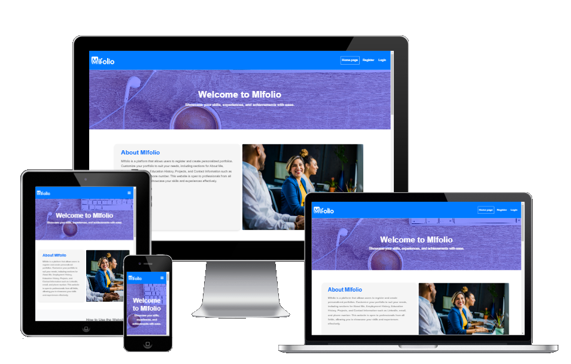

# [MiPortfolio](https://django-portfolio-cc-22a794f01134.herokuapp.com)

[](https://github.com/chrysanthusobinna/django-portfolio/commits/main)
[](https://github.com/chrysanthusobinna/django-portfolio/commits/main)
[](https://github.com/chrysanthusobinna/django-portfolio)

 ## Overview

**MiPortfolio** is a web-based application designed to help individuals create an online portfolio. Users can register, log in, and update their profiles with various sections they wish to include. The application allows customization of sections such as About, Employment Timeline, Education Timeline, Certification Timeline, Portfolio, and Contact Information. 

MiPortfolio is open to everyone, regardless of their job specialty, enabling users to showcase their portfolios on social media platforms, CVs, and other professional networks. This visibility allows recruiters and potential business partners to learn about them and connect.



 
## UX

#### Color Scheme

- **Background Color:** `#f8f9fa`
  - The light grey background color provides a clean and modern look, ensuring that the content is easy to read and visually appealing.

- **Page Header Color:** `#007bff` with `color: white`
  - The blue header color creates a cohesive and harmonious design, while the white text ensures high contrast and readability, making the header stand out.

- **Page Footer Color:** `#343a40` with `color: white`
  - The dark grey footer color provides a strong foundation for the page, grounding the design. The white text color maintains readability and consistency with the header, creating a balanced and professional appearance.

#### Typography

- **Font:** Arial, sans-serif
  - Arial is a widely used sans-serif font known for its clean and modern appearance. It is highly readable on both screens and print, making it an excellent choice for a portfolio website. The use of a sans-serif font also aligns with contemporary design trends, ensuring that the website looks up-to-date and professional.


## User Stories

### New Site Users

- As a new site user, I would like to register on the website, so that I can create my portfolio.  
- As a new site user, I would like to log in and log out of the website, so that I can access and manage my portfolio securely.  
- As a new site user, I would like to visit the home page, so that I can see information about the website.  
- As a new site user, I would like to navigate to the "Register" and "Login" pages from the home page, so that I can easily access the registration and login functionalities.

### Returning Site Users

- As a returning site user, I would like to manage my profile, so that I can update my personal information.  
- As a returning site user, I would like to add my employment history, so that I can showcase my work experience.  
- As a returning site user, I would like to add my education details, so that I can highlight my academic background.  
- As a returning site user, I would like to add my certifications and training, so that I can demonstrate my professional development.  
- As a returning site user, I would like to add my portfolio projects, so that I can showcase my work.  
- As a returning site user, I would like to add my contact information, so that I can display my contact details.  
- As a returning site user, I would like to customize the sections in my portfolio, so that I can tailor it to my preferences.

### Site Admin

- As a site administrator, I should be able to manage user accounts, so that I can ensure the platform is secure and functional.  
- As a site administrator, I should be able to review submitted portfolios, so that I can support users.  
- As a site administrator, I should be able to manage contact form submissions, so that I can respond to inquiries efficiently.  
- As a site administrator, I should be able to make changes to any user account, so that I can assist with updates or resolve issues on behalf of users.

---

## Features

### Existing Features

- **User Registration**  
  Allows new users to create an account by providing their details. This feature ensures that users can securely register and access the platform.

  

- **User Login**  
  Enables registered users to log in to their accounts using their credentials. This feature ensures secure access to user profiles and personalized content.

  

- **Customize About and Profile Photo**  
  Users can customize their profiles by adding About section and also Users can save and delete their profile photos. This feature allows users to personalize their profiles with a professional image.

  


- **Employment Management**  
  Users can add, edit, and delete employment entries. This feature enables users to showcase their work experience and career progression.

  
  


- **Education Management**  
  Users can add, edit, and delete education entries. This feature allows users to present their academic background and achievements.

  
   

- **Certification Management**  
  Users can add, edit, and delete certifications. This feature helps users highlight their qualifications and professional development.

  
  

- **Portfolio Management**  
  Users can add, edit, and delete portfolio items. This feature allows users to showcase their work and achievements in a structured manner.

  
  


- **Contact Information Management**  
  Users can update and delete their contact information. This feature ensures that users can provide up-to-date contact details for networking and professional connections.

  
  
  

- **Admin Dashboard**  
  Provides administrators with an overview of the site's activity and tools to manage users, content, and site settings. This feature ensures efficient site management and user administration.

 
 

### Future Features to Implement

- **AI-Powered CV Upload and Profile Generation**  
  A feature that allows users to upload their CV in PDF or Word document format. The system uses AI to analyze the CV and automatically generate a profile for the user, organizing their information into relevant sections such as About, Employment, Education, Certifications, and Portfolio.


- **AI-Generated CV Creation**  
  A feature that uses AI to generate a CV based on the information in the user's profile. This feature will allow users to easily create a professional CV by leveraging the data they have already entered into their profile.


- **Skill Endorsements**  
  A feature that allows users to endorse each other's skills. This feature can help users validate their expertise and build credibility within their professional network.


- **Portfolio Analytics**  
  A feature that provides users with analytics on their portfolio views, including the number of views, the most viewed sections, and the sources of traffic. This feature can help users understand the impact of their portfolio and make data-driven improvements.


- **Customizable Themes**  
  A feature that allows users to choose from a variety of themes to customize the look and feel of their portfolio. This feature can help users create a unique and personalized presentation of their professional information.


- **Integration with Job Boards**  
  A feature that integrates the portfolio with popular job boards, allowing users to easily apply for jobs using their MiPortfolio profile. This feature can streamline the job application process and increase the visibility of users' profiles to potential employers.


- **Unique Domain Names**  
  A feature that allows users to have a unique domain attached to their profile, such as `www.chrysanthusobinna.com` instead of `www.example.com/chrysanthusobinna`. This feature can help users create a more professional and personalized online presence.


## Tools & Technologies Used

- [](https://tim.2bn.dev/markdown-builder) used to generate README and TESTING templates.
- [](https://git-scm.com) used for version control. (`git add`, `git commit`, `git push`)
- [](https://github.com) used for secure online code storage.

- IDE
- [](https://gitpod.io) used as a cloud-based IDE for development.

- LANGUAGES:
- [](https://en.wikipedia.org/wiki/HTML) used for the main site content.
- [](https://en.wikipedia.org/wiki/CSS) used for the main site design and layout.
- [](https://www.javascript.com) used for user interaction on the site.
- [](https://jquery.com) used for user interaction on the site.
- [](https://www.python.org) used as the back-end programming language.

- DEPLOYMENT: 
- [](https://www.heroku.com) used for hosting the deployed back-end site

- CSS FRAMEWORKS

- [](https://getbootstrap.com) used as the front-end CSS framework for modern responsiveness and pre-built components.

- MISCELLANEOUS

- [](https://jestjs.io) used for automated JavaScript testing.
- [](https://www.djangoproject.com) used as the Python framework for the site.
- [](https://dbs.ci-dbs.net) used as the Postgres database from Code Institute.
- [](https://cloudinary.com) used for online static file storage.
- [](https://whitenoise.readthedocs.io) used for serving static files with Heroku.
- [](https://balsamiq.com/wireframes) used for creating wireframes.
- [](https://mail.google.com) used for sending emails in my application.
- [](https://fontawesome.com) used for the icons.
- [](https://chat.openai.com) used to help debug, troubleshoot, and explain things.

## Database Design

## Data Model

### Profilephoto
Stores a user's profile photo.
- `user`: Links to a user.
- `profile_photo`: The photo itself.

### About
Stores information about a user.
- `user`: Links to a user.
- `about`: Text field for the user's description.

### Employment
Stores employment history.
- `user`: Links to a user.
- `employer_name`: Name of the employer.
- `job_title`: Job title.
- `description_of_duties`: Description of job duties.
- `start_date` and `end_date`: Employment period.

### Education
Stores educational background.
- `user`: Links to a user.
- `qualification`: Degree or qualification.
- `institution_name`: Name of the institution.
- `start_date` and `end_date`: Education period.

### Certification
Stores certifications.
- `user`: Links to a user.
- `name`: Name of the certification.
- `issuer`: Issuing organization.
- `date_issued`: Date of issuance.

### Portfolio
Stores portfolio projects.
- `user`: Links to a user.
- `title`: Title of the project.
- `description`: Description of the project.
- `link`: URL link to the project.
- `portfolio_photo`: Photo related to the project.

### Contact
Stores contact information.
- `user`: Links to a user.
- `phone_number`: Phone number.
- `email_address`: Email address.
- `linkedin`: LinkedIn profile URL.
 
---

 
## Entity Relationship Diagrams (ERD)
I have used `pygraphviz` and `django-extensions` to auto-generate an ERD.

The steps taken were as follows:
- In the terminal: `sudo apt update`
- then: `sudo apt-get install python3-dev graphviz libgraphviz-dev pkg-config`
- then type `Y` to proceed
- then: `pip3 install django-extensions pygraphviz`
- in my `settings.py` file, I added the following to my `INSTALLED_APPS`:
```python
INSTALLED_APPS = [
    ...
    'django_extensions',
    ...
]
```
- back in the terminal: `python3 manage.py graph_models -a -o erd.png`
- dragged the new `erd.png` file into my `documentation/` folder
- removed `'django_extensions',` from my `INSTALLED_APPS`
- finally, in the terminal: `pip3 uninstall django-extensions pygraphviz -y`


---

## Agile Development Process

### GitHub Projects

I utilized [GitHub Projects](https://github.com/chrysanthusobinna/django-portfolio/projects) to manage this project using Agile methodologies. This tool helped in organizing tasks, tracking progress, and ensuring the project stayed on schedule.


The screenshot above shows the GitHub Projects board, which was instrumental in managing the project efficiently.


## Testing

> [!NOTE]  
> For all testing, please refer to the [TESTING.md](TEST.md) file.

## Deployment

The live deployed application can be found deployed on [Heroku](https://django-portfolio-cc-22a794f01134.herokuapp.com).

### PostgreSQL Database

This project uses a [Code Institute PostgreSQL Database](https://dbs.ci-dbs.net).

To obtain my own Postgres Database from Code Institute, I followed these steps:

- Signed-in to the CI LMS using my email address.
- An email was sent to me with my new Postgres Database.

> [!CAUTION]  
> - PostgreSQL databases by Code Institute are only available to CI Students.
> - You must acquire your own PostgreSQL database through some other method
> if you plan to clone/fork this repository.
> - Code Institute students are allowed a maximum of 8 databases.
> - Databases are subject to deletion after 18 months.

### Cloudinary API

This project uses the [Cloudinary API](https://cloudinary.com) to store media assets online, due to the fact that Heroku doesn't persist this type of data.

To obtain your own Cloudinary API key, create an account and log in.

- For *Primary interest*, you can choose *Programmable Media for image and video API*.
- Optional: *edit your assigned cloud name to something more memorable*.
- On your Cloudinary Dashboard, you can copy your **API Environment Variable**.
- Be sure to remove the `CLOUDINARY_URL=` as part of the API **value**; this is the **key**.


 
## Heroku Deployment

This project uses [Heroku](https://www.heroku.com), a Platform as a Service (PaaS) that enables developers to build, run, and operate applications entirely in the cloud.

### Deployment Steps

1. **Create a New App**
   - Log in to your Heroku Dashboard.
   - Click **New** in the top-right corner and select **Create new app**.
   - Provide a **unique app name**, choose the region closest to you (EU or USA), and click **Create App**.

2. **Configure Environment Variables**
   - Go to your app's **Settings**.
   - Scroll down to **Config Vars** and click **Reveal Config Vars**.
   - Add the following environment variables:

   | **Key**               | **Description**                                                                 |
   |------------------------|---------------------------------------------------------------------------------|
   | `DATABASE_URL`         | The URL of the database used for the application. Replace with your database URL. |
   | `CLOUDINARY_URL`       | The URL for Cloudinary integration. Replace with your Cloudinary credentials.   |
   | `SECRET_KEY`           | A unique and secure key for your Django application. Replace with your own secret key. |
   | `EMAIL_PORT`           | The port used for sending emails (e.g., `587` for TLS). Replace with your email port. |
   | `EMAIL_HOST_USER`      | The email address used as the sender for outgoing emails. Replace with your email address. |
   | `EMAIL_HOST_PASSWORD`  | The password for the email address used for sending emails. Replace with your email password. |

> **Note:** Ensure all sensitive information is securely stored and never shared publicly.

3. **Prepare Necessary Files**
   Heroku requires the following files to deploy a Django project:
   - `requirements.txt`: Lists all the dependencies needed for the project.
   - `Procfile`: Specifies the commands Heroku should run to start your application.
   - `runtime.txt`: Specifies the Python version used for the project.
   - edit portfolio/settings.py and set DEBUG=false 

   To create or update these files:
   - Install dependencies with `pip3 install -r requirements.txt`.
   - Check your Python version using `python3 --version` and add it to `runtime.txt` (e.g., `python-3.9.19`).

4. **Deploy Your App**
   - Connect your GitHub repository to your Heroku app via the **Deploy** tab.
   - Scroll down to **Manual Deploy**, select the branch you want to deploy, and click **Deploy Branch**.
   - Monitor the deployment logs to ensure all steps complete successfully.

5. **Launch Your App**
   - Once deployment is complete, you will see the message: *"App was successfully deployed"*.
   - Click the **View** button to access your deployed application.
 


### Local Deployment

This project can be cloned or forked to create a local copy on your system.

#### Prerequisites

- Install any applicable packages found within the `requirements.txt` file:
  - `pip3 install -r requirements.txt`.

- Rename `env-example.py` to `env.py` and set the environment variables as listed in the Heroku deployment steps.

> **Note**: The `env.py` file is only used in the local environment and should not be included in production or deployment.

#### Steps for Local Development

1. Edit `portfolio/settings.py`:
   - Set `DEBUG = True` to ensure static files load and errors display during development.

2. Run the following commands:
   - Start the Django app: `python3 manage.py runserver`
   - Stop the app: `CTRL+C` or `⌘+C` (Mac)
   - Make migrations: `python3 manage.py makemigrations`
   - Apply migrations: `python3 manage.py migrate`
   - Create a superuser: `python3 manage.py createsuperuser`
   - Restart the app: `python3 manage.py runserver`

---

### Cloning

To clone the repository:

1. Go to the [GitHub repository](https://github.com/chrysanthusobinna/django-portfolio).
2. Locate the **Code** button and click it.
3. Choose your preferred method (HTTPS, SSH, or GitHub CLI) and copy the URL.
4. Open Git Bash or Terminal.
5. Navigate to the directory where you want the project.
6. Run the command:
   - `git clone https://github.com/chrysanthusobinna/django-portfolio.git`
7. Press Enter to clone the repository.

#### Gitpod

To use Gitpod, click the button below to create a workspace with this repository:

[](https://gitpod.io/#https://github.com/chrysanthusobinna/django-portfolio)

> **Note**: Ensure the Gitpod browser extension is installed. Follow the [Gitpod tutorial](https://www.gitpod.io/docs/configure/user-settings/browser-extension) for setup instructions.

---

### Forking

To fork the repository:

1. Log in to GitHub and navigate to the [GitHub Repository](https://github.com/chrysanthusobinna/django-portfolio).
2. Click the **Fork** button at the top-right of the repository page.
3. Once forked, the repository will appear in your GitHub account for independent development.

---

### Local vs. Deployment

These differences ensure proper functionality in both environments while maintaining security and efficiency.

- **Environment Variables**:
  - **Local**: Use `env.py` to manage environment variables.
  - **Deployment**: Set variables directly in Heroku's Config Vars. `env.py` is not used.

- **Debug Mode**:
  - **Local**: Set `DEBUG = True` to load static files and view errors.
  - **Deployment**: Set `DEBUG = False` to optimize performance and enhance security.

---

## Credits

### Content

Use this space to provide attribution links to any borrowed code snippets, elements, or resources.

| Source | Location | Notes |
| --- | --- | --- |
| [Markdown Builder](https://tim.2bn.dev/markdown-builder) | README and TESTING | Tool to help generate the Markdown files |


### Media

| Source | Location | Type | Notes |
| --- | --- | --- | --- |
| [Flaticon](https://www.flaticon.com/free-icon/user_1077012) | User icon | PNG | User icon used |
| [Flaticon](https://www.flaticon.com/free-icon/hashtag_1199417) | Default.png | PNG | Used for default.png |
| [Pexels](https://www.pexels.com/photo/book-next-to-the-keyboard-15555952/) | Home page | Image | Photo by Walls.io from Pexels |
| [Pexels](https://www.pexels.com/photo/close-up-shot-of-scrabble-tiles-on-a-blue-surface-2789781/) | Home page | Image | Photo by Ann H from Pexels |
| [Pexels](https://www.pexels.com/photo/woman-in-blue-suit-jacket-2422293/) | Home page | Image | Photo by Jopwell from Pexels |

### Acknowledgements

- I would like to thank my Code Institute mentor, [Tim Nelson](https://github.com/TravelTimN) for his support throughout the development of this project.
- I would like to thank the [Code Institute](https://codeinstitute.net) tutor team for their assistance with troubleshooting and debugging some project issues.
- I would like to thank the [Code Institute Slack community](https://code-institute-room.slack.com) for the moral support; it kept me going during periods of self-doubt and impostor syndrome.
- Special thanks to [Chima Nwadike](http://linkedin.com/in/chima-nwadike-ba1618102) and [Olumuyiwa Folorunso](http://linkedin.com/in/olumuyiwafolorunso) for their guidance and support.

