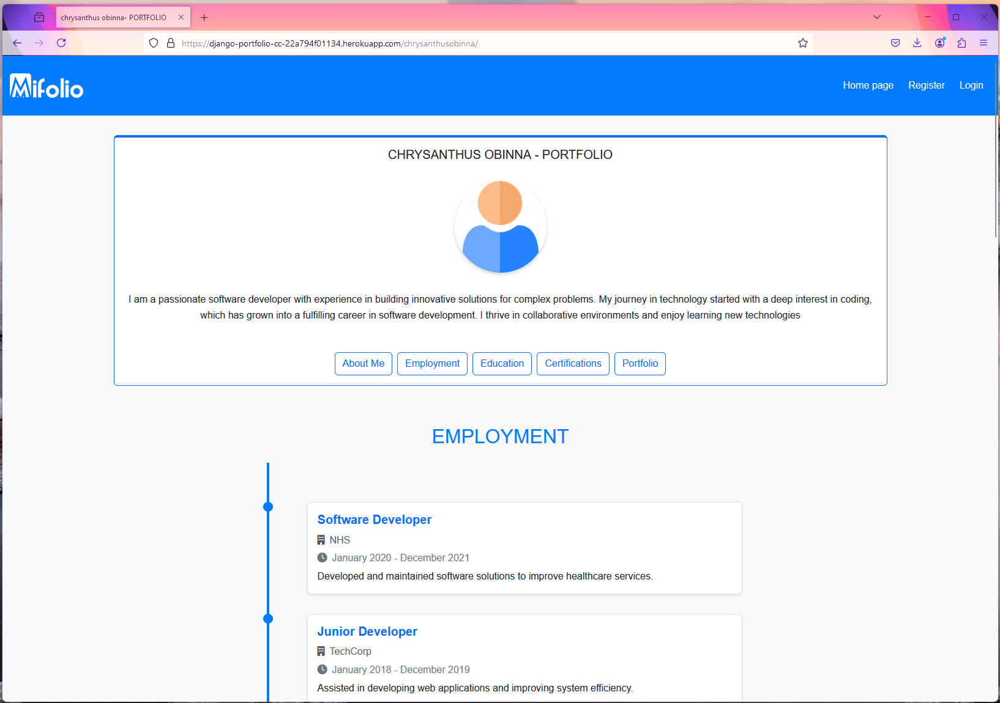
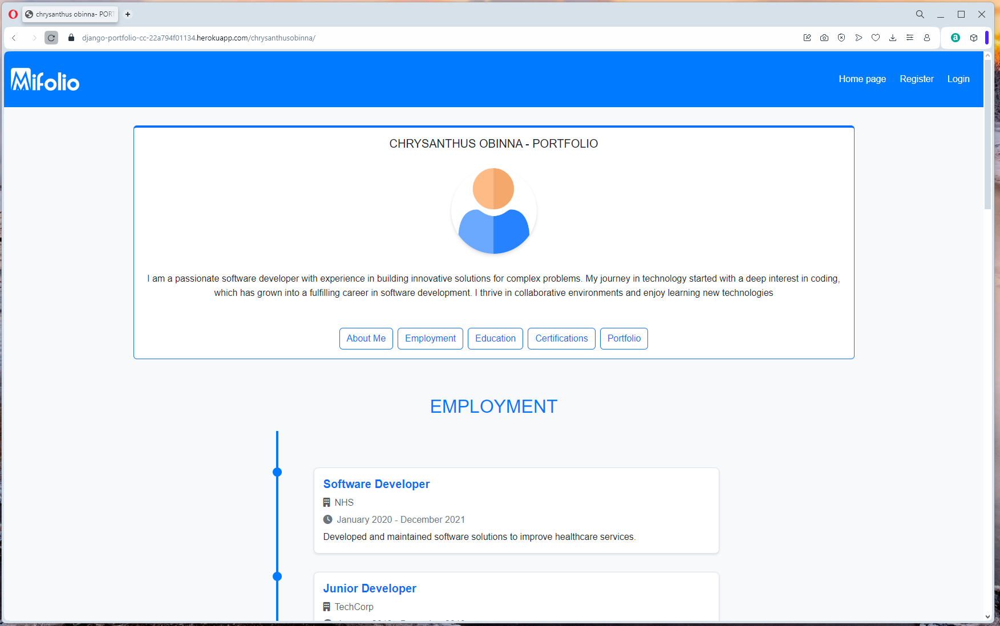
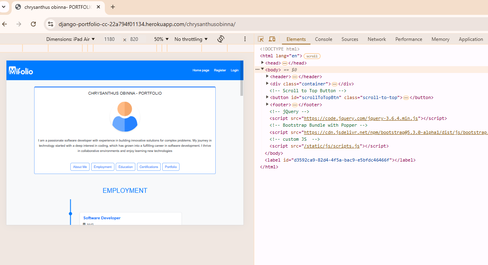

# Testing

> [!NOTE]  
> Return back to the [README.md](README.md) file.

## Feature-by-Feature Testing

### Navigation
- Verified smooth transitions between pages.
- Checked that all links direct to the correct destinations.


### Responsive Design
- Tested the site on various devices and screen sizes (mobile, tablet, desktop).
- Confirmed consistent layout and functionality across devices.

### Portfolio Display
- Ensured all projects are properly showcased with accurate descriptions, images, and links.
- Checked that external links open in a new tab and direct to the intended destinations.

### Contact Form
- Tested form submission with valid and invalid inputs.
- Confirmed that users receive a success message upon submission.
- Verified that messages are stored correctly in the database.

## Regression Testing
- After updates, re-tested all core features to ensure no existing functionality was broken.
- Verified navigation, responsive design, portfolio display, and contact form submissions still work as intended.

---
This testing process confirms that the project functions as intended and provides a seamless user experience.


## Code Validation

I utilized the recommended [HTML W3C Validator](https://validator.w3.org) to validate all my HTML files. Using the live link, I viewed the source code, accessed the HTML W3C Validator, and selected the "Validate by Direct Input" tab. I then copied the entire source code and inserted it for validation. Below are the results for the custom pages I created:

| Directory                | File                                                                                                                                                    | Screenshot                                                      | Notes                                      |
|--------------------------|----------------------------------------------------------------------------------------------------------------------------------------------------------|-----------------------------------------------------------------|--------------------------------------------|
| portfolio_app/templates  | home.html                                                                                                                                               |  | Document checking completed. No errors or warnings to show. |
| templates/account/       | login.html                                                                                                                                              |  | Document checking completed. No errors or warnings to show. |
| templates/account/       | signup.html                                                                                                                                             |  | Document checking completed. No errors or warnings to show. |
| templates/account/       | logout.html                                                                                                                                             |  | Document checking completed. No errors or warnings to show. |
| portfolio_app/templates  | user-portfolio.html                                                                                                                                     |  | Document checking completed. No errors or warnings to show. |
| portfolio_app/templates  | edit-user-portfolio.html, home-page.html, modal-about.html, modal-certification.html, modal-contact.html, modal-education.html, modal-employment.html, modal-portfolio.html, modal-profilephoto.html, scroll-to-top.html |  | Document checking completed. No errors or warnings to show. |


I used the [CSS Jigsaw Validator](https://jigsaw.w3.org/css-validator) to check my CSS files. On the validator website, I selected the option to input my CSS directly. After copying and pasting my CSS code into the provided text box, I ran the validation process by clicking the "Check" button. The validator confirmed that there were no errors, displaying a message stating, "Congratulations! No Error Found."

| Directory | File | Screenshot | Notes |
| --- | --- | --- | --- |
| static/css/ | styles.css |  | Congratulations! No Error Found. |


### JavaScript

I used the recommended [JShint Validator](https://jshint.com) to validate all of my JS files.

**Summary of Results:**
- There are 35 functions in the file.
- The function with the largest signature takes 2 arguments, while the median is 0.
- The largest function has 16 statements, while the median is 1.
- The most complex function has a cyclomatic complexity value of 2, with a median of 1.
- There are 29 warnings, mostly about using `const` and `object short notation` which are available in ES6 or Mozilla JS extensions.
- There are also 2 undefined variables reported.

| Directory | File | Screenshot | Notes |
| --- | --- | --- | --- |
| static/js/ | scripts.js |  | `No Error Found.` |


### Python

I have used the recommended [PEP8 CI Python Linter](https://pep8ci.herokuapp.com) to validate all of my Python files.

| Directory      | File           | CI URL                                                                                  | Screenshot                                                       | Notes                         |
|----------------|----------------|-----------------------------------------------------------------------------------------|------------------------------------------------------------------|-------------------------------|
|                | manage.py      | [PEP8 CI](https://pep8ci.herokuapp.com/https://raw.githubusercontent.com/chrysanthusobinna/django-portfolio/main/manage.py) |         | All clear, no errors found   |
| portfolio      | settings.py    | [PEP8 CI](https://pep8ci.herokuapp.com/https://raw.githubusercontent.com/chrysanthusobinna/django-portfolio/main/portfolio/settings.py) |        | All clear, no errors found   |
| portfolio      | urls.py        | [PEP8 CI](https://pep8ci.herokuapp.com/https://raw.githubusercontent.com/chrysanthusobinna/django-portfolio/main/portfolio/urls.py) |  | All clear, no errors found   |
| portfolio_app  | admin.py       | [PEP8 CI](https://pep8ci.herokuapp.com/https://raw.githubusercontent.com/chrysanthusobinna/django-portfolio/main/portfolio_app/admin.py) |           | All clear, no errors found   |
| portfolio_app  | context_processors.py | [PEP8 CI](https://pep8ci.herokuapp.com/https://raw.githubusercontent.com/chrysanthusobinna/django-portfolio/main/portfolio_app/context_processors.py) |  | All clear, no errors found   |
| portfolio_app  | forms.py       | [PEP8 CI](https://pep8ci.herokuapp.com/https://raw.githubusercontent.com/chrysanthusobinna/django-portfolio/main/portfolio_app/forms.py) |           | All clear, no errors found   |
| portfolio_app  | helpers.py     | [PEP8 CI](https://pep8ci.herokuapp.com/https://raw.githubusercontent.com/chrysanthusobinna/django-portfolio/main/portfolio_app/helpers.py) |         | All clear, no errors found   |
| portfolio_app  | models.py      | [PEP8 CI](https://pep8ci.herokuapp.com/https://raw.githubusercontent.com/chrysanthusobinna/django-portfolio/main/portfolio_app/models.py) |          | All clear, no errors found   |
| portfolio_app  | signals.py     | [PEP8 CI](https://pep8ci.herokuapp.com/https://raw.githubusercontent.com/chrysanthusobinna/django-portfolio/main/portfolio_app/signals.py) |         | All clear, no errors found   |
| portfolio_app  | urls.py        | [PEP8 CI](https://pep8ci.herokuapp.com/https://raw.githubusercontent.com/chrysanthusobinna/django-portfolio/main/portfolio_app/urls.py) |            | All clear, no errors found   |
| portfolio_app  | utils.py       | [PEP8 CI](https://pep8ci.herokuapp.com/https://raw.githubusercontent.com/chrysanthusobinna/django-portfolio/main/portfolio_app/utils.py) |           | All clear, no errors found   |
| portfolio_app  | views.py       | [PEP8 CI](https://pep8ci.herokuapp.com/https://raw.githubusercontent.com/chrysanthusobinna/django-portfolio/main/portfolio_app/views.py) |           | All clear, no errors found   |

 
 
## Browser Compatibility

I've tested my deployed project on multiple browsers to check for compatibility issues.

| Browser  | Home Screenshot                                   | User Portfolio Screenshot                                    | Notes                                    |
|----------|--------------------------------------------------|------------------------------------------------------------|------------------------------------------|
| Chrome   |           |          | Works as expected. No issues identified. |
| Firefox  |          |         | Works as expected. No issues identified. |
| Opera    |            |           | Works as expected. No issues identified. |

 
 
## Responsiveness

I've tested my deployed project using Googlechrome built-in device sizes in the Developer Tools to check for responsiveness issues. Here are the results for the Home page and User Portfolio page:

### Tested for:
- Mobile
- Tablet
- Desktop

| Device   | Home                                                              | User Portfolio                                                         | Notes            |
|----------|-------------------------------------------------------------------|------------------------------------------------------------------------|------------------|
| Mobile   |        |    | No issues. Worked as expected.  |
| Tablet   |        |    | No issues. Worked as expected.  |
| Desktop  |       |   | No issues. Worked as expected.  |

This table shows the compatibility results for different device sizes, confirming that the site works as expected on mobile, tablet, and desktop. 


## Lighthouse Audit

I tested my deployed project using the Google Chrome Developer Lighthouse Audit tool to evaluate performance and identify potential issues.


### Home Page  
  

| Metric           | Score | Notes                                                                 |
|-------------------|-------|-----------------------------------------------------------------------|
| **Performance**   | 50    | The page shows reasonable performance, with room for optimization.   |
| **Accessibility** | 89    | Most accessibility features are effectively implemented.             |
| **Best Practices**| 100   | All recommended best practices are fully implemented.                |
| **SEO**           | 92    | The page is well-optimized for search engines.                      |

---

### User Portfolio Page  
  

| Metric           | Score | Notes                                                                 |
|-------------------|-------|-----------------------------------------------------------------------|
| **Performance**   | 92    | A commendable performance score, indicating a well-optimized page.   |
| **Accessibility** | 80    | Accessibility standards are nearly perfect, ensuring inclusivity.    |
| **Best Practices**| 61    | Improvements can be made to fully align with best practices.         |
| **SEO**           | 92    | The page is effectively optimized for search visibility.            |

---

### Edit User Portfolio Page  
  

| Metric           | Score | Notes                                                                 |
|-------------------|-------|-----------------------------------------------------------------------|
| **Performance**   | 95    | A good performance score, suggesting effective optimization.         |
| **Accessibility** | 84    | The page adheres closely to accessibility standards.                 |
| **Best Practices**| 61    | Minor adjustments are needed to fully meet best practices.           |
| **SEO**           | 92    | The page is well-prepared for search engine optimization.            |

---

### Sign Out Page  
  

| Metric           | Score | Notes                                                                 |
|-------------------|-------|-----------------------------------------------------------------------|
| **Performance**   | 97    | Performance is acceptable, but there is potential for optimization.  |
| **Accessibility** | 80    | The page is highly accessible, supporting diverse user needs.        |
| **Best Practices**| 100   | All recommended best practices are fully implemented.                |
| **SEO**           | 92    | Search engine optimization is effectively implemented.              |

---

### Login Page  
  

| Metric           | Score | Notes                                                                 |
|-------------------|-------|-----------------------------------------------------------------------|
| **Performance**   | 98    | Performance is satisfactory, with some scope for refinement.         |
| **Accessibility** | 83    | The page meets most accessibility requirements, ensuring usability.  |
| **Best Practices**| 100   | All recommended best practices are fully implemented.                |
| **SEO**           | 92    | The page is well-optimized for search engines.                      |

---

### Register Page  
  

| Metric           | Score | Notes                                                                 |
|-------------------|-------|-----------------------------------------------------------------------|
| **Performance**   | 96    | Performance is solid, with opportunities for optimization.           |
| **Accessibility** | 83    | Accessibility standards are well-addressed, providing inclusivity.   |
| **Best Practices**| 100   | All recommended best practices are fully implemented.                |
| **SEO**           | 92    | The page demonstrates strong search engine optimization.            |

--- 


 ## Defensive Programming

| **Test Case**                                  | **Description**                                                                                     | **Screenshot**                                  |
|------------------------------------------------|-----------------------------------------------------------------------------------------------------|------------------------------------------------|
| **Empty Form Submission**                      | Users cannot submit a form with empty required fields.                                               |     |
| **Invalid Email Address**                      | Users must enter valid email addresses in email fields.                                              |  |
| **Restricted URL Access**                      | Users cannot brute-force URLs to access restricted pages (e.g., admin-only pages). user will redirected to login page                  |  |
| **CRUD Restrictions for Logged-Out Users**     | Non-authenticated users cannot perform CRUD actions.                                                |  |
| **Cross-User Data Manipulation**               | User-A should not be able to view or manipulate data belonging to User-B.                           |  |
| **File Upload Validation**                     | Only allow uploads of specific file types and sizes.                                                |    |


## User Story Testing

### User Stories

#### New Site Users

| User Story | Screenshot |
| --- | --- |
| As a new site user, I would like to register on the website, so that I can create my portfolio. |  |
| As a new site user, I would like to log in and log out of the website, so that I can access and manage my portfolio securely. |  |
| As a new site user, I would like to visit the home page, so that I can see information about the website. |  |
| As a new site user, I would like to navigate to the "Register" and "Login" pages from the home page, so that I can easily access the registration and login functionalities. |  |

#### Returning Site Users

| User Story | Screenshot |
| --- | --- |
| As a returning site user, I would like to manage my profile, so that I can update my personal information. |  |
| As a returning site user, I would like to add my employment history, so that I can showcase my work experience. |  |
| As a returning site user, I would like to add my education details, so that I can highlight my academic background. |  |
| As a returning site user, I would like to add my certifications and training, so that I can demonstrate my professional development. |  |
| As a returning site user, I would like to add my portfolio projects, so that I can showcase my work. |  |
| As a returning site user, I would like to add my contact information, so that I can display my contact details. |  |
| As a returning site user, I would like to customize the sections in my portfolio, so that I can tailor it to my preferences. |  |


## Automated Testing

### JavaScript (Jest Testing)

The application functionality has been tested using the [Jest](https://jestjs.io) JavaScript testing framework.

#### Setting Up Jest

To use Jest, the first step was to initialize NPM:

```bash
npm init
```

Press `enter` for all options except for the **test command**, where you should type `jest`.

Next, Jest was added to the **Dev Dependencies** in the development environment:

```bash
npm install --save-dev jest
```

#### Running Tests

To execute the tests, use the following command:

```bash
npm test
```

#### Test Results

| Test Suites          | Tests                | Screenshot                                      |
|----------------------|----------------------|------------------------------------------------|
| 15 passed, 15 total  | 17 passed, 17 total |  |

#### Jest Test Issues

There were no issues encountered during testing.
 

### Python (Unit Testing)

Django's built-in unit testing framework was used to test the application's functionality.

#### Running Tests

To execute the tests, the following command was used in the terminal:

```bash
python3 manage.py test portfolio_app.tests
```

#### Generating a Coverage Report

To create a coverage report, the following steps were performed:

1. Install the `coverage` package:
   ```bash
   pip3 install coverage
   ```

2. Update the `requirements.txt` file:
   ```bash
   pip3 freeze --local > requirements.txt
   ```

3. Run the coverage tool while excluding unnecessary files:
   ```bash
   coverage run --omit=*/site-packages/*,*/migrations/*,*/__init__.py,env.py manage.py test portfolio_app.tests
   ```

4. View the coverage report in the terminal:
   ```bash
   coverage report
   ```

#### Viewing the HTML Coverage Report

To generate and view the HTML version of the coverage report, these commands were used:

1. Generate the HTML report:
   ```bash
   coverage html
   ```

2. Start a local server to view the report:
   ```bash
   python3 -m http.server
   ```

3. Navigate to the `htmlcov/` directory in a browser to view detailed coverage results.

Below are the results from the test coverage.

#### Files

 | File                                                | Statements | Missing | Excluded | Coverage |
|-----------------------------------------------------|------------|---------|----------|----------|
| manage.py                                      | 11         | 2       | 0        | 82%      |
| portfolio_app/admin.py                         | 2          | 0       | 0        | 100%     |
| portfolio_app/apps.py                          | 7          | 0       | 0        | 100%     |
| portfolio_app/context_processors.py            | 3          | 0       | 0        | 100%     |
| portfolio_app/forms.py                         | 42         | 0       | 0        | 100%     |
| portfolio_app/helpers.py                       | 16         | 4       | 0        | 75%      |
| portfolio_app/models.py                        | 52         | 1       | 0        | 98%      |
| portfolio_app/signals.py                       | 12         | 5       | 0        | 58%      |
| portfolio_app/tests/test_about_form.py         | 26         | 0       | 0        | 100%     |
| portfolio_app/tests/test_about_model.py        | 23         | 0       | 0        | 100%     |
| portfolio_app/tests/test_add_certification_view.py | 31      | 0       | 0        | 100%     |
| portfolio_app/tests/test_add_education_view.py | 25         | 0       | 0        | 100%     |
| portfolio_app/tests/test_add_employment_view.py| 26         | 0       | 0        | 100%     |
| portfolio_app/tests/test_add_portfolio_view.py | 48         | 0       | 0        | 100%     |
| portfolio_app/tests/test_certification_form.py | 38         | 0       | 0        | 100%     |
| portfolio_app/tests/test_certification_model.py| 26         | 0       | 0        | 100%     |
| portfolio_app/tests/test_contact_delete.py     | 29         | 0       | 0        | 100%     |
| portfolio_app/tests/test_contact_form.py       | 37         | 0       | 0        | 100%     |
| portfolio_app/tests/test_contact_model.py      | 25         | 0       | 0        | 100%     |
| portfolio_app/tests/test_contact_update_view.py| 45         | 0       | 0        | 100%     |
| portfolio_app/tests/test_custom_signup_form.py | 38         | 0       | 0        | 100%     |
| portfolio_app/tests/test_delete_about_view.py  | 32         | 0       | 0        | 100%     |
| portfolio_app/tests/test_delete_certification_view.py | 33   | 0       | 0        | 100%     |
| portfolio_app/tests/test_delete_education_view.py | 26     | 0       | 0        | 100%     |
| portfolio_app/tests/test_delete_employment_view.py | 33    | 0       | 0        | 100%     |
| portfolio_app/tests/test_delete_profile_photo_view.py | 33 | 0       | 0        | 100%     |
| portfolio_app/tests/test_edit_certification_view.py | 34    | 0       | 0        | 100%     |
| portfolio_app/tests/test_edit_education_view.py| 35         | 0       | 0        | 100%     |
| portfolio_app/tests/test_edit_employment_view.py | 39      | 0       | 0        | 100%     |
| portfolio_app/tests/test_edit_portfolio_view.py| 28         | 0       | 0        | 100%     |
| portfolio_app/tests/test_edit_user_profile_view.py | 30    | 0       | 0        | 100%     |
| portfolio_app/tests/test_education_form.py     | 43         | 0       | 0        | 100%     |
| portfolio_app/tests/test_education_model.py    | 27         | 0       | 0        | 100%     |
| portfolio_app/tests/test_employment_model.py   | 28         | 0       | 0        | 100%     |
| portfolio_app/tests/test_home_view.py          | 30         | 0       | 0        | 100%     |
| portfolio_app/tests/test_portfolio_form.py     | 32         | 0       | 0        | 100%     |
| portfolio_app/tests/test_portfolio_model.py    | 26         | 0       | 0        | 100%     |
| portfolio_app/tests/test_profilephoto_form.py  | 13         | 0       | 0        | 100%     |
| portfolio_app/tests/test_profilephoto_model.py | 12         | 0       | 0        | 100%     |
| portfolio_app/tests/test_save_about_view.py    | 34         | 0       | 0        | 100%     |
| portfolio_app/tests/test_save_profile_photo_view.py | 4     | 0       | 0        | 100%     |
| portfolio_app/tests/test_urls.py               | 67         | 0       | 0        | 100%     |
| portfolio_app/tests/test_user_profile_view.py  | 0          | 0       | 0        | 100%     |
| portfolio_app/tests/test_validate_image_file.py| 21         | 0       | 0        | 100%     |
| portfolio_app/urls.py                          | 3          | 0       | 0        | 100%     |
| portfolio_app/utils.py                         | 19         | 6       | 0        | 68%      |
| portfolio_app/views.py                         | 314        | 64      | 0        | 80%      |
| portfolio/settings.py                          | 46         | 0       | 0        | 100%     |
| portfolio/urls.py                              | 3          | 0       | 0        | 100%     |
| **Total**                                           | **1607**   | **82**  | **0**    | **95%**  |


#### Classes

| File                                    | Class                        | Statements | Missing | Excluded | Coverage |
|-----------------------------------------|------------------------------|------------|---------|----------|----------|
| manage.py                               | (no class)                  | 11         | 2       | 0        | 82%      |
| portfolio_app/admin.py                  | (no class)                  | 2          | 0       | 0        | 100%     |
| portfolio_app/apps.py                   | PortfolioAppConfig          | 1          | 0       | 0        | 100%     |
| portfolio_app/apps.py                   | (no class)                  | 6          | 0       | 0        | 100%     |
| portfolio_app/context_processors.py     | (no class)                  | 3          | 0       | 0        | 100%     |
| portfolio_app/forms.py                  | CustomSignupForm            | 6          | 0       | 0        | 100%     |
| portfolio_app/forms.py                  | ContactForm                 | 0          | 0       | 0        | 100%     |
| portfolio_app/forms.py                  | ContactForm.Meta            | 0          | 0       | 0        | 100%     |
| portfolio_app/forms.py                  | PortfolioForm               | 0          | 0       | 0        | 100%     |
| portfolio_app/forms.py                  | PortfolioForm.Meta          | 0          | 0       | 0        | 100%     |
| portfolio_app/forms.py                  | CertificationForm           | 0          | 0       | 0        | 100%     |
| portfolio_app/forms.py                  | CertificationForm.Meta      | 0          | 0       | 0        | 100%     |
| portfolio_app/forms.py                  | EducationForm               | 0          | 0       | 0        | 100%     |
| portfolio_app/forms.py                  | EducationForm.Meta          | 0          | 0       | 0        | 100%     |
| portfolio_app/forms.py                  | EmploymentForm              | 0          | 0       | 0        | 100%     |
| portfolio_app/forms.py                  | EmploymentForm.Meta         | 0          | 0       | 0        | 100%     |
| portfolio_app/forms.py                  | AboutForm                   | 0          | 0       | 0        | 100%     |
| portfolio_app/forms.py                  | AboutForm.Meta              | 0          | 0       | 0        | 100%     |
| portfolio_app/forms.py                  | ProfilephotoForm            | 0          | 0       | 0        | 100%     |
| portfolio_app/forms.py                  | ProfilephotoForm.Meta       | 0          | 0       | 0        | 100%     |
| portfolio_app/forms.py                  | (no class)                  | 36         | 0       | 0        | 100%     |
| portfolio_app/helpers.py                | (no class)                  | 16         | 4       | 0        | 75%      |
| portfolio_app/models.py                 | Profilephoto                | 1          | 1       | 0        | 0%       |
| portfolio_app/models.py                 | About                       | 1          | 0       | 0        | 100%     |
| portfolio_app/models.py                 | Employment                  | 1          | 0       | 0        | 100%     |
| portfolio_app/models.py                 | Education                   | 1          | 0       | 0        | 100%     |
| portfolio_app/models.py                 | Certification               | 1          | 0       | 0        | 100%     |
| portfolio_app/models.py                 | Portfolio                   | 1          | 0       | 0        | 100%     |
| portfolio_app/models.py                 | Contact                     | 1          | 0       | 0        | 100%     |
| portfolio_app/models.py                 | (no class)                  | 45         | 0       | 0        | 100%     |
| portfolio_app/signals.py                | (no class)                  | 12         | 5       | 0        | 58%      |
| portfolio_app/tests/test_about_form.py  | AboutFormTests              | 17         | 0       | 0        | 100%     |
| portfolio_app/tests/test_about_form.py  | (no class)                  | 9          | 0       | 0        | 100%     |
| portfolio_app/tests/test_about_model.py | AboutModelTests             | 15         | 0       | 0        | 100%     |
| portfolio_app/tests/test_about_model.py | (no class)                  | 8          | 0       | 0        | 100%     |
| portfolio_app/utils.py                  | (no class)                  | 19         | 6       | 0        | 68%      |
| portfolio_app/views.py                  | (no class)                  | 314        | 64      | 0        | 80%      |
| portfolio/settings.py                   | (no class)                  | 46         | 0       | 0        | 100%     |
| portfolio/urls.py                       | (no class)                  | 3          | 0       | 0        | 100%     |
| **Total**                               |                              | **1607**   | **82**  | **0**    | **95%**  |


 
